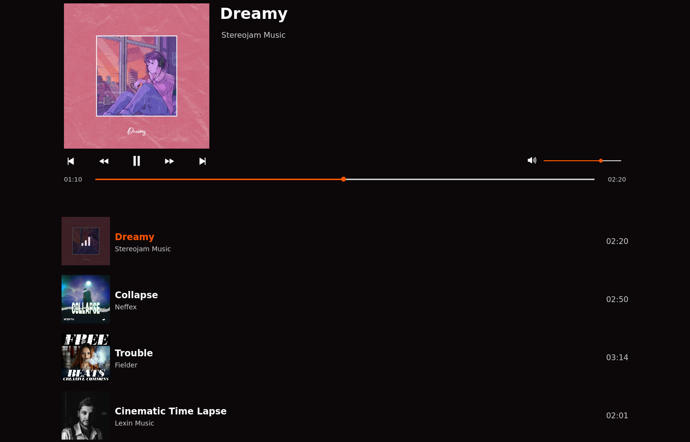

# React Audio Player App 🧠&nbsp; 

## How you will build it ✨
- The audio player should offer control features like playing or pausing a track, adjusting volume, moving to the next or previous track and moving a progress slider.

- Tracks can be stored within the project or consumed from an API

- If the user has gone through all of the track, you will figure out how to start at the beginning, to allow them to cycle through the tracks again.

- Finally, if you want to take your audio player to the next level,try adding a list with all the songs available for the album that the currently playing song belongs to
&nbsp;

---

## React concepts you need to apply 📝
- Define a file/directory structure according to your needs

- Build the UI with different components

- Share components data using Props

- Add Interactivity with State

- Apply conditional rendering

- Handle events

- Handle side effects

- Access native html elements property through refs

- Split up your code with the use of custom hooks
&nbsp;

---

## Tooling (optional) 🔨
- [Vite](https://vitejs.dev/) - Next Generation Frontend Tooling
- [React Icons](https://react-icons.github.io/react-icons) - SVG React icons of popular icon packs using ES6 imports.
- [Deezer API](https://developers.deezer.com/login?redirect=/api) - Online music streaming platform
&nbsp;

---
  
## Partial result (unfinished) 🚀
&nbsp;
