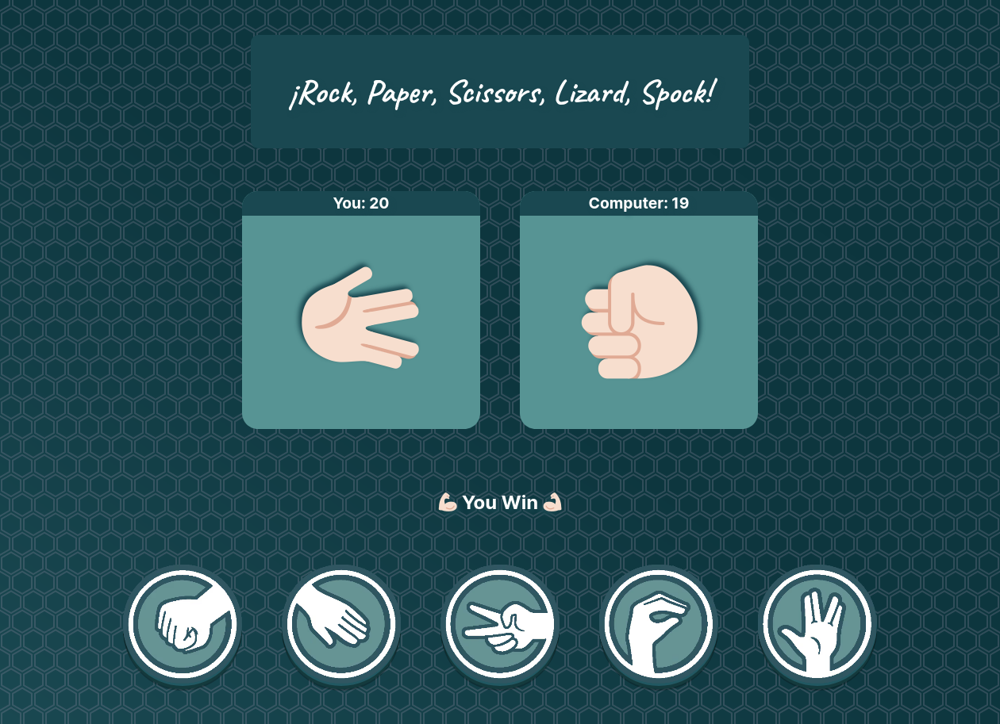

# React Rock, Paper, Scissors, Lizard, Spock App 📋 &nbsp; 

## Introduction
Rock, Paper, Scissors, Lizard, Spock is a game of chance that expands the traditional game of Rock, Paper, Scissors.
Each player picks a variable and reveals it at the same time. The winner is the one who defeats the others. In a tie, the process is repeated until a winner is found. 
This is a diagram of the game's rules:

  

How it works is scissors cuts paper, paper covers rock, rock crushes lizard, lizard poisons Spock, Spock smashes scissors, scissors decapitates lizard, lizard eats paper, paper disproves Spock, Spock vaporizes rock, and as it always has, rock crushes scissors.

You are asked to build a React app where you can play this game against the CPU.

## How you will build it ✨
- The app should have five different buttons, one for each movement in the game.

- There should be a player input section where the movements selected are shown.

- Whenever the user taps one of the buttons, the movement selected should be visible on the player's input section.

- Whenever the user taps one of the buttons, a random movement should be selected for the CPU player as well.

- Whenever the user taps one of the buttons, the winner of the game should be displayed in a label below the player's input section.

- It should have two counters, one for each player, that show how many games each player has won.

- Style the app in the way you like it most, and use whatever styling tool you want for the work.

---

## React concepts you need to apply 📝
- Define a file/directory structure according to your needs

- Build the UI with different components

- Share components data using Props

- Add Interactivity with State

- Apply conditional rendering

- Handle events
&nbsp;

---

## Tooling (optional) 🔨
- [Vite](https://vitejs.dev/) - Next Generation Frontend Tooling
&nbsp;

---
  
## Final Result 🚀
&nbsp;

  

