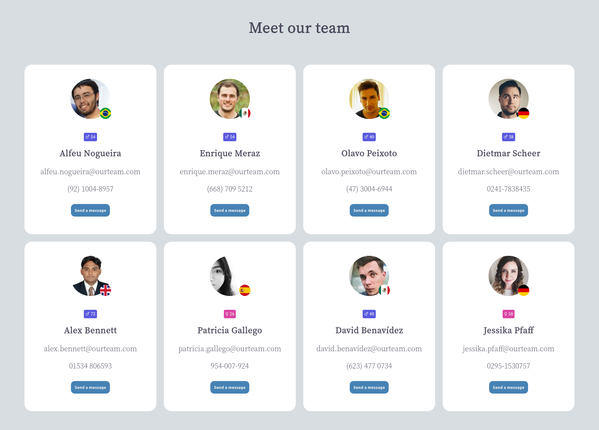

# React Support Desk App 🖥 &nbsp; 

## How you will build it ✨
- The app should show a list of support desk employees as well as their contact information.

- The information displayed should be the following: the name, the age, the gender, the email, the number, and the nationality of the employee.

- You can display up to eight employees on the screen.

- Below the employee's information, it should have a button that allows the user to send a direct message to the employee.

- When clicking the button, you can display a modal with a contact form or open your default email manager software. The decision is up to you.

- There is no need to add logic to the form, since you are going to use fake data from [this API](https://randomuser.me/) to get your users.
&nbsp;

---

## React concepts you need to apply 📝
- Define a file/directory structure according to your needs.

- Build the UI with different components.

- Share component data using Props

- Add Interactivity with State

- Apply conditional rendering

- Handle events

- Handle side effects
&nbsp;

---

## Tooling (optional) 🔨
- [Vite](https://vitejs.dev/) - Next Generation Frontend Tooling
- [Random User](https://randomuser.me/) - A free, open-source API for generating random user data.
- [Axios](https://axios-http.com/) - Promise based HTTP client for the browser and node.js
&nbsp;

---
  
## Final Result 🚀
&nbsp;
