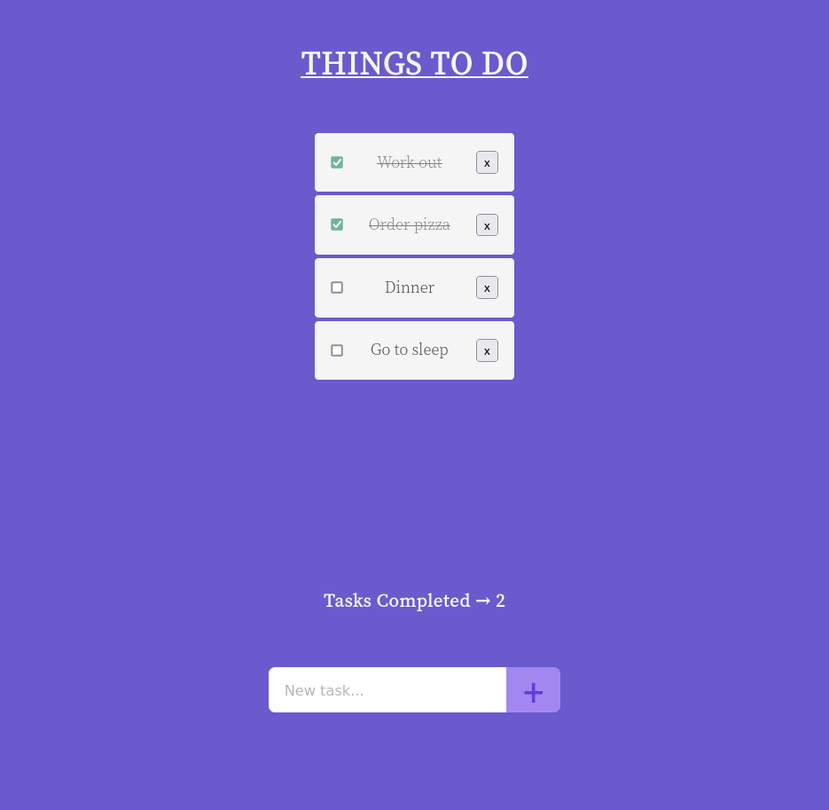

# React ToDo App 📋 &nbsp; 

## How you will build it ✨
- The app should list all the tasks (finished and unfinished) in a single row.

- The user should be able to mark any task as completed or unfinished by clicking over it.

- The user should be able to delete any task by clicking a delete button.

- At the bottom of the list, it should show how many tasks have already been completed.

- The user should be able to add new tasks using an input form placed below the task completed counter.

- Try styling the app with CSS styles written in JavaScript using a library such as Styled-Components, Emotion, or Glamorous. 
&nbsp;

---

## React concepts you need to apply 📝
- Define a file/directory structure according to your needs

- Build the UI with different components

- Share components data using Props

- Add Interactivity with State

- Apply conditional rendering

- Handle events

- Use the context API to avoid prop drilling.
&nbsp;

---

## Tooling (optional) 🔨
- [Vite](https://vitejs.dev/) - Next Generation Frontend Tooling
- [styled-components](https://styled-components.com/) - Visual primitives for the component age
- [Emotion](https://emotion.sh/docs/introduction) - A library designed for writing css styles with JavaScript
- [glamorous](https://glamorous.rocks/) - Maintainable CSS with React
&nbsp;

---
  
## Final Result 🚀
&nbsp;
