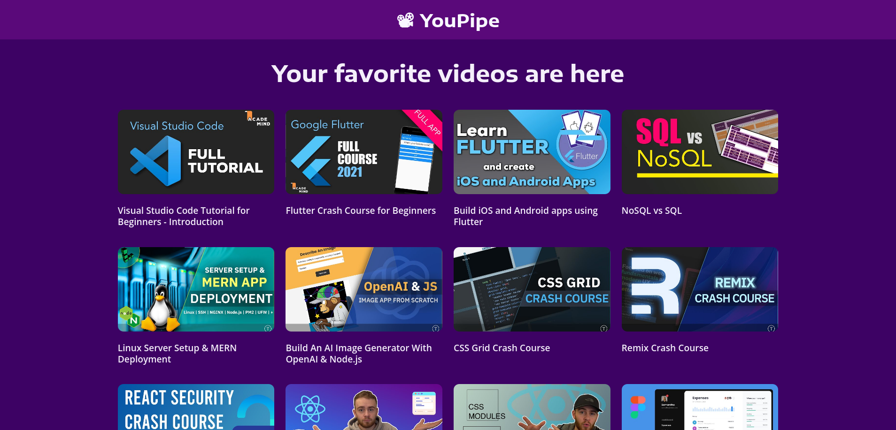
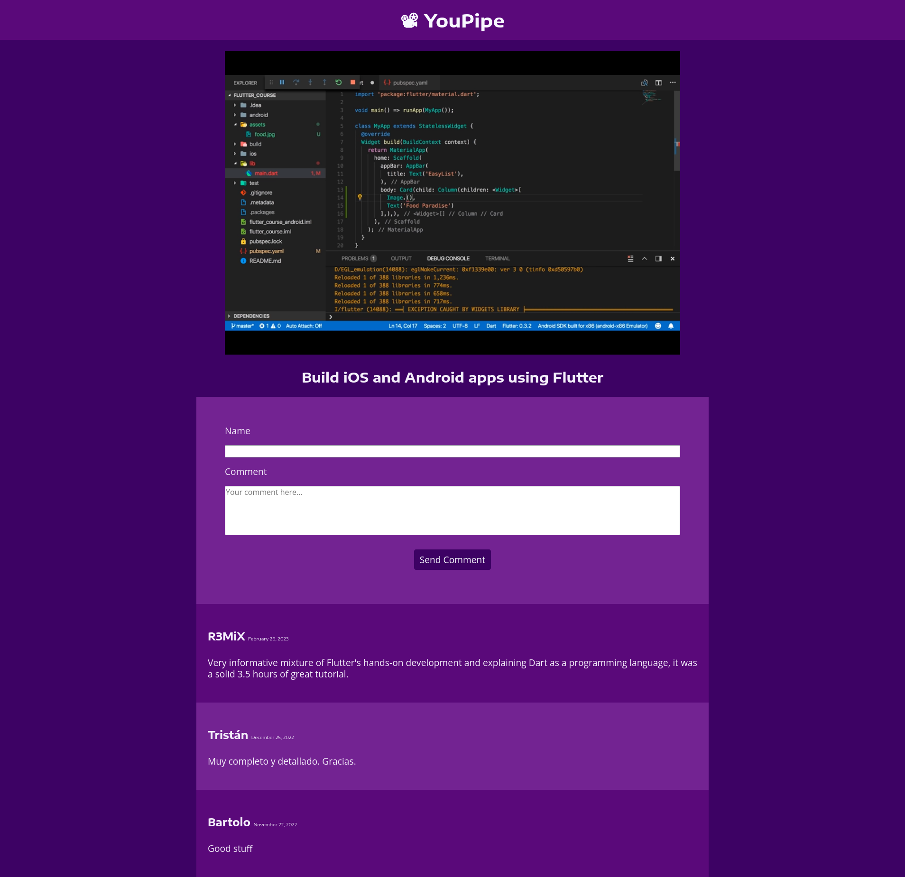

# React Video App 🎥 &nbsp; 

## How you will build it ✨
- On the app's main page, a list of YouTube videos should be displayed.

- Clicking any video should take the user to a page where the video can be played.

- There should be a comments section below the video where users can comment and see comments from other users.

- You can add a 404 page to handle urls with unknown IDs.

- Use whatever tool you want to style the app.  :)
&nbsp;

---

## React concepts you need to apply 📝
- Create a file or directory structure that meets your requirements.

- Build the UI with different components.

- Use Props to share component data.

- Add Interactivity with State

- Use conditional rendering.

- Use the context API.

- Apply routing logic to your pages.
&nbsp;

---

## Tooling (optional) 🔨
- [Vite](https://vitejs.dev/) - Next Generation Frontend Tooling
- [React Router](https://reactrouter.com/en/main) - Lightweight, fully-featured routing library for React
&nbsp;

---
  
## Final result 🚀
&nbsp;

&nbsp;
