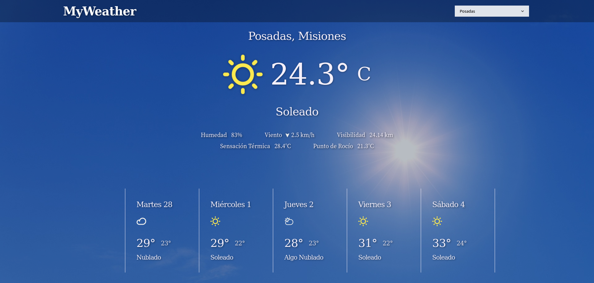

# React Weather App 🌥 &nbsp; 

## How you will build it ✨ 
- The app should display the current weather (temperature + appropriate icon and label)

- You can add some extra details about the current weather, like humidity, dew point, apparent temperature, visibility, wind speed and direction, etc.

- The app should also display the forecast for the next 5 days.

- The user should be able to select between five different locations. Then the weather for that location should be displayed (as well as the forecast for the next five days).

- You should get the data from a trustworthy source like [Open Weather Map](https://openweathermap.org/api), [Open-Meteo](https://open-meteo.com/), [AccuWeather](https://developer.accuweather.com/) or [Micro Weather Service](https://m3o.com/weather/api).

- Use whatever tool you want to style the app.  :)
&nbsp;

---

## React concepts you need to apply 📝
- Create a file or directory structure that meets your requirements.

- Build the UI with different components.

- Use Props to share component data.

- Add Interactivity with State

- Use conditional rendering.

- Use hooks to manage state and handle side effects
&nbsp;

---

## Tooling (optional) 🔨
- [Vite](https://vitejs.dev/) - Next Generation Frontend Tooling.
- [Axios](https://axios-http.com/docs/intro) - Promise based HTTP client for the browser and node.js.
- [phosphor-react](https://github.com/phosphor-icons/react) - Flexible icon family for interfaces, diagrams, presentations.
- Any of the APIs mentioned in the "[How you will build it](#how_to_build_it)" section.
&nbsp;

---
  
## Final result 🚀
&nbsp;
